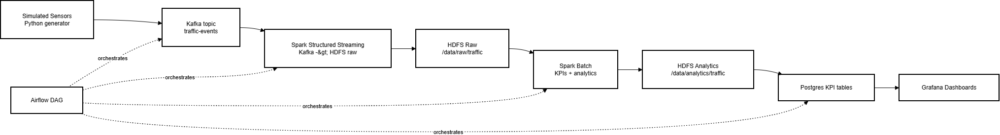
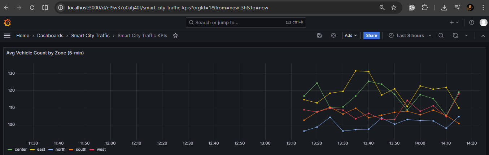
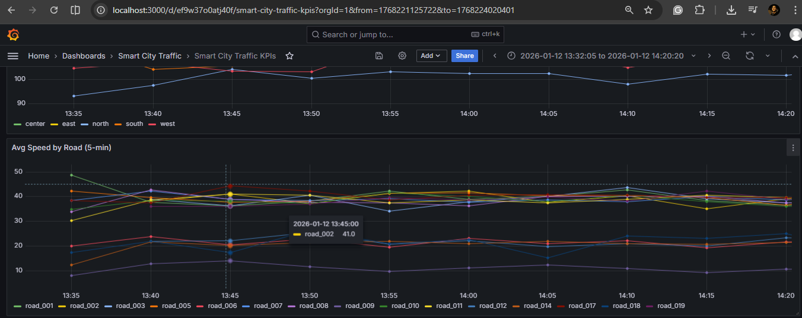
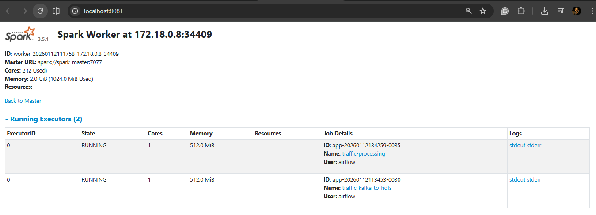

# Smart City Traffic Project

This repository implements the Smart City Traffic pipeline end to end: simulated sensors -> Kafka -> HDFS raw -> Spark processing -> analytics (Parquet) -> Postgres KPI tables -> Grafana dashboards, orchestrated by Airflow.

## Architecture
Process overview: the generator emits events, Kafka buffers them, Spark Streaming lands raw data in HDFS, Spark batch computes KPIs into analytics Parquet, the loader writes KPI tables to Postgres, and Grafana visualizes the KPIs. Airflow schedules and monitors the steps.

## Grafana Screens
These dashboards read KPI tables from Postgres and refresh every few minutes.

## Spark
Spark runs two workloads:
- Structured Streaming: Kafka -> HDFS raw at `/data/raw/traffic` (partitioned by `dt` and `zone`).
- Batch KPIs: reads raw data, computes KPIs, writes analytics Parquet to `/data/analytics/traffic`.

When streaming is active, Spark UI (`http://localhost:8080`) shows `traffic-kafka-to-hdfs` as RUNNING.

## Project Structure
- `generator/`: traffic sensor simulator + Kafka producer.
- `spark/`: Spark jobs (streaming ingest, batch KPIs, load to Postgres).
- `airflow/dags/`: orchestration DAGs.
- `docker/`: Docker Compose stack + configs.
- `docs/`: architecture notes, KPIs, assumptions, screenshots checklist.
- `commands.md`: PowerShell command runbook.

## Pipeline Steps
1) Data generator emits JSON events: `sensor_id`, `road_id`, `road_type`, `zone`, `vehicle_count`, `average_speed`, `occupancy_rate`, `event_time`.
2) Kafka topic `traffic-events` receives the stream.
3) Spark Streaming writes raw data to `/data/raw/traffic` and checkpoints to `/data/checkpoints/traffic_raw`.
4) Spark batch cleans data and computes KPIs (avg traffic by zone, avg speed by road, congestion rate, critical zones).
5) Analytics Parquet tables are stored at `/data/analytics/traffic`.
6) KPI tables are loaded into Postgres and visualized in Grafana.
7) Airflow orchestrates all tasks on a 5 minute schedule.

## How to Run
Use `commands.md` for the exact PowerShell commands and verification steps.

## How to Validate Each Stage
- Kafka: consume a few events from `traffic-events`.
- HDFS raw: check `/data/raw/traffic` partitions.
- HDFS analytics: check `/data/analytics/traffic` tables.
- Postgres: KPI table row counts should increase over time.
- Grafana: panels should show data within the last 30 minutes and update every 5 minutes.
- Airflow: DAG runs should complete with all tasks `success`.
