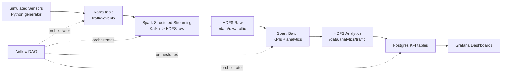

# Architecture Diagram

```mermaid
flowchart LR
  S[Simulated Sensors<br/>Python generator] --> K[Kafka topic<br/>traffic-events]
  K --> SS[Spark Structured Streaming<br/>Kafka -> HDFS raw]
  SS --> R[HDFS Raw<br/>/data/raw/traffic]
  R --> SB[Spark Batch<br/>KPIs + analytics]
  SB --> A[HDFS Analytics<br/>/data/analytics/traffic]
  A --> PG[Postgres KPI tables]
  PG --> G[Grafana Dashboards]

  AF[Airflow DAG] -.orchestrates.-> K
  AF -.orchestrates.-> SS
  AF -.orchestrates.-> SB
  AF -.orchestrates.-> PG
```
